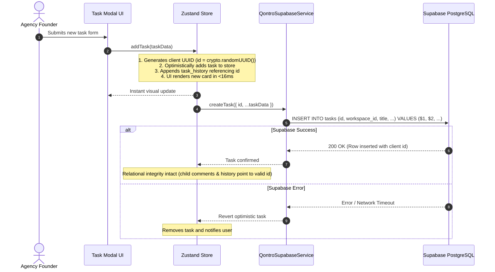
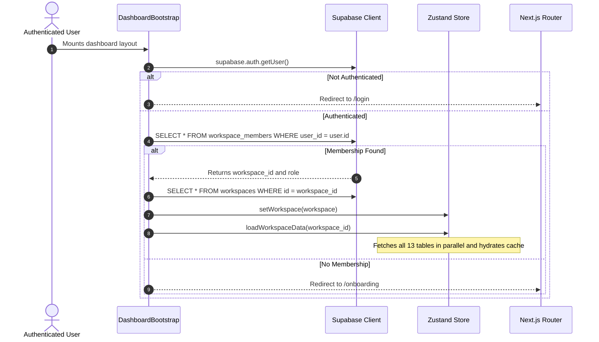
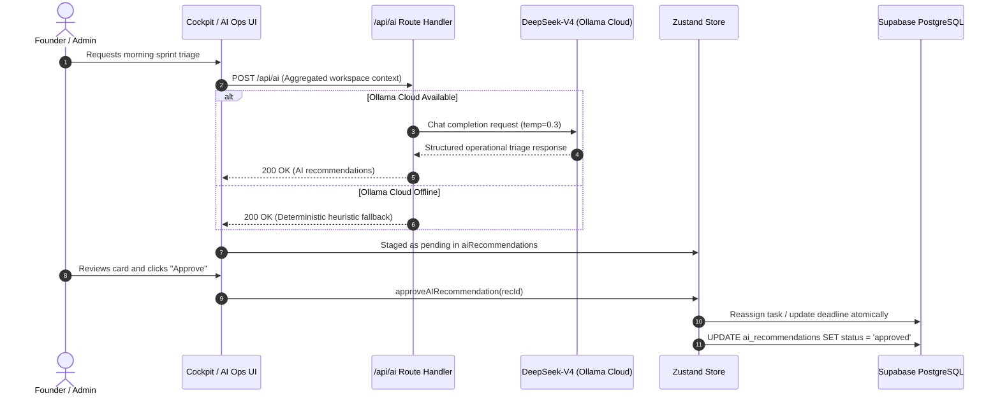

# Software Design Document (SDD): Qontro Architecture

**Document Reference:** QONTRO-SDD-V2.0  
**Target System:** Qontro Agency Operations Platform  
**Architecture Style:** Next.js Server/Client Tier + Supabase PostgreSQL Multi-Tenant Tier (13 Tables)  
**Status:** Approved Engineering Reference  

---

## 1. System Overview

Qontro is structured as a cloud-native SaaS application optimized for low-latency operational management in 3–25 person digital agencies and consultancies. It combines client-side optimistic state rendering with server-side edge validation and database-enforced multi-tenant isolation across 13 relational tables.

```
+-------------------------------------------------------------------------------+
|                                  USER BROWSER                                 |
|                                                                               |
|  +-------------------------------------------------------------------------+  |
|  | Next.js App Router (React 19, TypeScript, Tailwind CSS v4)              |  |
|  | - Client Pages: `/`, `/tasks`, `/projects`, `/team`, `/finance`, ...     |  |
|  | - UI Components: Header, Sidebar, KanbanBoard, InvoicePreviewModal      |  |
|  +-------------------------------------------------------------------------+  |
|                                     ^                                         |
|                                     | (Optimistic updates / Direct Selectors) |
|  +-------------------------------------------------------------------------+  |
|  | Zustand Global State Store (`src/store/index.ts`)                       |  |
|  | - Cache: 13 Entities (tasks, projects, members, invoices, expenses, etc)|  |
|  | - Reconciled optimistic mutations with preserved client UUIDs          |  |
|  +-------------------------------------------------------------------------+  |
+-------------------------------------------------------------------------------+
                                      |
                                      | HTTPS (SSR & API calls)
                                      v
+-------------------------------------------------------------------------------+
|                            NEXT.JS EDGE & ROUTE LAYER                         |
|                                                                               |
|  - Edge Middleware (`src/middleware.ts`): Supabase auth cookie auto-refresh   |
|  - Server Route (`src/app/api/ai/route.ts`): DeepSeek-V4 Ollama gateway       |
|  - Auth Callback (`src/app/auth/callback/route.ts`): OAuth / Code exchange    |
+-------------------------------------------------------------------------------+
                         |                                    |
                         | HTTPS / REST (PostgREST)           | REST (Bearer Auth)
                         v                                    v
+------------------------------------+   +--------------------------------------+
|        SUPABASE POSTGRESQL         |   |          OLLAMA CLOUD API            |
|  - 13 Tables with RLS              |   |  - Model: `deepseek-v4-flash:cloud`  |
|  - Auth Schema (JWT / Sessions)    |   |  - Temperature: 0.3                  |
|  - Triggers, Views & Indexes       |   |  - System Prompt constraints         |
+------------------------------------+   +--------------------------------------+
```

---

## 2. Architectural Design Principles

1. **Zero Perceived UI Lag with Reconciled Optimism:** State modifications update the Zustand memory store immediately, reflecting in the UI within 16ms. To prevent foreign key split-brain desynchronization, client-generated UUIDs are preserved during insertion so child records (`task_comments`, `task_history`) never reference orphaned keys.
2. **Database-Level Tenant Isolation:** Security is enforced via PostgreSQL Row Level Security (RLS) on all 13 tables using `auth.uid()` and verified `workspace_members` records.
3. **Deterministic AI Governance (HITL):** The AI engine operates strictly as an analytical advisor with read-only access to operational context. All actions are staged in `ai_recommendations` and require founder approval before execution.
4. **Integer Currency Arithmetic:** Operational expenses are stored as `amount_cents BIGINT` to eliminate floating-point drift across invoicing and profit computations.

---

## 3. Component & State Architecture

### 3.1 Zustand Store Topology (`src/store/index.ts`)

```typescript
interface AppState {
  // Tenant & Core Entities (13 Domains)
  currentWorkspace: Workspace | null;
  workspaces: Workspace[];
  members: WorkspaceMember[];
  skills: Skill[];
  projects: Project[];
  tasks: Task[];
  taskHistories: TaskHistory[];
  clients: Client[];
  invoices: Invoice[];
  expenses: Expense[];
  documents: Document[];
  activityLogs: ActivityLog[];
  aiRecommendations: AIRecommendation[];
  loadingState: LoadingState;

  // Lifecycle & Sync
  loadWorkspaceData: (workspaceId: string) => Promise<void>;
  setWorkspace: (workspace: Workspace) => void;
  createWorkspace: (name: string, currency?: string) => Promise<void>;

  // Task Mutations (Optimistic + DB Persisted)
  addTask: (task: Omit<Task, 'id' | 'created_at'>) => void;
  deleteTask: (taskId: string) => void;
  updateTaskStatus: (taskId: string, status: TaskStatus) => void;
  assignTask: (taskId: string, memberId: string) => void;
  addTaskComment: (taskId: string, content: string, authorName?: string) => void;

  // Projects & Clients
  addProject: (project: Omit<Project, 'id' | 'created_at' | 'health_score'>) => void;
  deleteProject: (projectId: string) => void;
  addClient: (client: Omit<Client, 'id' | 'created_at' | 'total_billed'>) => void;
  deleteClient: (clientId: string) => void;

  // Invoices & Expenses
  addInvoice: (invoice: Omit<Invoice, 'id'>) => void;
  deleteInvoice: (invoiceId: string) => void;
  updateInvoiceStatus: (invoiceId: string, status: InvoiceStatus) => void;
  addExpense: (expense: Omit<Expense, 'id' | 'created_at'>) => void;
  deleteExpense: (expenseId: string) => void;

  // Memory & Governance
  addDocument: (doc: Omit<Document, 'id' | 'updated_at'>) => void;
  deleteDocument: (docId: string) => void;
  updateDocument: (id: string, title: string, content: string) => void;
  approveAIRecommendation: (recommendationId: string) => void;
  dismissAIRecommendation: (recommendationId: string) => void;
  logActivity: (log: Omit<ActivityLog, 'id' | 'created_at'>) => void;
}
```

### 3.2 Directory Structure
```
src/
├── app/
│   ├── (dashboard)/
│   │   ├── layout.tsx         # Dashboard shell (Sidebar + Header + Bootstrap)
│   │   ├── page.tsx           # Founder Command Cockpit
│   │   ├── projects/page.tsx  # Project portfolio & health monitor
│   │   ├── tasks/page.tsx     # Skill-routed Kanban board
│   │   ├── team/page.tsx      # Team members & verified skill matrix
│   │   ├── finance/page.tsx   # Receivables, expenses & PDF invoice generator
│   │   ├── memory/page.tsx    # SOPs & contract repository (XSS-sanitized)
│   │   ├── ai-ops/page.tsx    # DeepSeek triage & recommendation cards
│   │   └── settings/page.tsx  # Workspace settings & members
│   ├── api/
│   │   └── ai/route.ts        # Server route handler for Ollama DeepSeek
│   ├── auth/
│   │   └── callback/route.ts  # Supabase Auth code exchange
│   ├── login/page.tsx         # Authentication sign-in
│   ├── signup/page.tsx        # Authentication registration with metadata
│   ├── onboarding/page.tsx    # Initial workspace onboarding
│   └── globals.css            # Tailwind CSS v4 tokens and theme variables
├── components/
│   ├── header.tsx             # Breadcrumbs, quick actions, user avatar
│   ├── sidebar.tsx            # Primary navigation bar with live badges
│   └── dashboard-bootstrap.tsx# Workspace session bootstrap & DB hydrator
├── lib/
│   ├── supabase/              # Browser and server Supabase client factories
│   ├── sanitize.ts            # DOMPurify HTML sanitization utility
│   └── utils.ts               # Currency, date, and class merging utilities
├── services/
│   └── supabaseService.ts     # Asynchronous database persistence layer
└── types/
    └── index.ts               # Strict TypeScript domain interfaces
```

---

## 4. Sequence & Data Flow Models

### 4.1 Reconciled Task Creation (Eliminating Split-Brain)



### 4.2 Workspace Bootstrap & Onboarding Sequence



### 4.3 Human-in-the-Loop AI Operational Triage Flow


