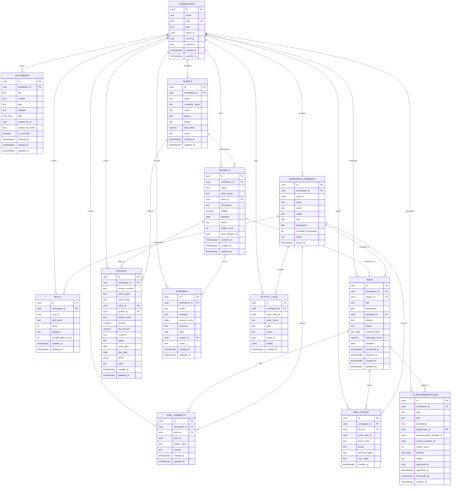

# Database Design Document (DDD): Qontro Schema

**Document Reference:** QONTRO-DDD-V2.0  
**Database Engine:** PostgreSQL 15+ (Cloud Instance on Supabase)  
**Security Model:** PostgreSQL Row Level Security (RLS) with JWT Tenant Scoping  
**Total Tables:** 13 Normalized Relational Tables  
**Status:** Approved for Production Deployment  

---

## 1. Relational Entity-Relationship (ER) Diagram



---

## 2. Table Dictionaries & Schema Definitions (13 Core Tables)

### 2.1 Table: `public.workspaces`
The root tenant entity. Every data record in Qontro references a `workspace_id`.

| Column | Type | Constraints | Description |
| :--- | :--- | :--- | :--- |
| `id` | `uuid` | `PRIMARY KEY`, Default `gen_random_uuid()` | Unique workspace identifier. |
| `name` | `text` | `NOT NULL` | Human-readable agency or studio name. |
| `slug` | `text` | `NOT NULL`, `UNIQUE` | URL-safe workspace slug (e.g. `apex-creative`). |
| `logo` | `text` | Nullable | Workspace avatar/logo URL. |
| `owner_id` | `uuid` | `NOT NULL` | Supabase Auth `user_id` of the founder. |
| `currency` | `text` | `NOT NULL`, Default `'USD'` | Standard 3-letter currency code for billing. |
| `timezone` | `text` | Default `'UTC'` | Primary timezone for deadlines. |
| `created_at` | `timestamptz` | `NOT NULL`, Default `now()` | Timestamp of workspace provisioning. |
| `updated_at` | `timestamptz` | `NOT NULL`, Default `now()` | Auto-updated modification timestamp. |

### 2.2 Table: `public.workspace_members`
Maps registered auth users to specific workspaces with role-based permissions and live workload tracking.

| Column | Type | Constraints | Description |
| :--- | :--- | :--- | :--- |
| `id` | `uuid` | `PRIMARY KEY`, Default `gen_random_uuid()` | Member record ID. |
| `workspace_id` | `uuid` | `NOT NULL`, `REFERENCES workspaces(id) ON DELETE CASCADE` | Associated workspace. |
| `user_id` | `uuid` | `NOT NULL` | Reference to `auth.users(id)`. |
| `name` | `text` | `NOT NULL` | Member display name. |
| `email` | `text` | `NOT NULL` | Member email address. |
| `avatar` | `text` | Nullable | Avatar image URL. |
| `role` | `text` | `NOT NULL`, Default `'member'`, `CHECK (role IN ('owner','admin','member','client'))` | Permission tier. |
| `designation` | `text` | `NOT NULL`, Default `'Team Member'` | Professional title (e.g. "Senior Frontend Engineer"). |
| `workload_percentage` | `int` | `NOT NULL`, Default `0`, `CHECK (workload_percentage BETWEEN 0 AND 100)` | Live workload utilization percentage. |
| `status` | `text` | `NOT NULL`, Default `'active'`, `CHECK (status IN ('active','busy','away'))` | Availability status. |
| `joined_at` | `timestamptz` | `NOT NULL`, Default `now()` | Timestamp of workspace entry. |
| *(Constraint)* | `UNIQUE` | `(workspace_id, user_id)` | Prevents duplicate memberships. |

### 2.3 Table: `public.skills`
Maintains verified technical and creative skill proficiencies per team member for intelligent task routing.

| Column | Type | Constraints | Description |
| :--- | :--- | :--- | :--- |
| `id` | `uuid` | `PRIMARY KEY`, Default `gen_random_uuid()` | Skill entry ID. |
| `workspace_id` | `uuid` | `NOT NULL`, `REFERENCES workspaces(id) ON DELETE CASCADE` | Associated workspace. |
| `user_id` | `uuid` | `NOT NULL` | Member possessing this skill. |
| `skill_name` | `text` | `NOT NULL` | Skill label (e.g. "React", "Figma", "PostgreSQL"). |
| `score` | `integer` | `NOT NULL`, Default `5`, `CHECK (score >= 1 AND score <= 10)` | Proficiency rating (1–10). |
| `category` | `text` | `NOT NULL`, Default `'engineering'`, `CHECK (category IN ('engineering','design','content','marketing','operations'))` | Domain category. |
| `verified_tasks_count` | `int` | `NOT NULL`, Default `0` | Count of successfully delivered tasks with this skill. |
| `created_at` | `timestamptz` | `NOT NULL`, Default `now()` | Timestamp. |
| `updated_at` | `timestamptz` | `NOT NULL`, Default `now()` | Modification timestamp. |
| *(Constraint)* | `UNIQUE` | `(workspace_id, user_id, skill_name)` | Prevents duplicate skill ratings per user. |

### 2.4 Table: `public.clients`
Maintains the agency client directory, contacts, and billing aggregates.

| Column | Type | Constraints | Description |
| :--- | :--- | :--- | :--- |
| `id` | `uuid` | `PRIMARY KEY`, Default `gen_random_uuid()` | Client ID. |
| `workspace_id` | `uuid` | `NOT NULL`, `REFERENCES workspaces(id) ON DELETE CASCADE` | Associated workspace. |
| `name` | `text` | `NOT NULL` | Primary contact name. |
| `company_name` | `text` | `NOT NULL`, Default `''` | Client enterprise or agency name. |
| `email` | `text` | `NOT NULL`, Default `''` | Primary billing contact email. |
| `phone` | `text` | Nullable | Contact telephone number. |
| `status` | `text` | `NOT NULL`, Default `'active'`, `CHECK (status IN ('active','lead','past'))` | Client relationship state. |
| `total_billed` | `numeric(14,2)` | `NOT NULL`, Default `0` | Cumulative lifetime settled billing amount. |
| `notes` | `text` | `NOT NULL`, Default `''` | Internal relationship notes. |
| `created_at` | `timestamptz` | `NOT NULL`, Default `now()` | Creation timestamp. |
| `updated_at` | `timestamptz` | `NOT NULL`, Default `now()` | Last modification timestamp. |

### 2.5 Table: `public.projects`
Represents client engagements and internal product deliverables.

| Column | Type | Constraints | Description |
| :--- | :--- | :--- | :--- |
| `id` | `uuid` | `PRIMARY KEY`, Default `gen_random_uuid()` | Project ID. |
| `workspace_id` | `uuid` | `NOT NULL`, `REFERENCES workspaces(id) ON DELETE CASCADE` | Associated workspace. |
| `name` | `text` | `NOT NULL` | Project name. |
| `client_name` | `text` | `NOT NULL`, Default `''` | Denormalized client display name. |
| `client_id` | `uuid` | Nullable, `REFERENCES clients(id) ON DELETE SET NULL` | Client relationship link. |
| `description` | `text` | `NOT NULL`, Default `''` | Project scope and deliverable description. |
| `budget` | `numeric(14,2)` | `NOT NULL`, Default `0` | Contract value in workspace currency. |
| `deadline` | `date` | `NOT NULL` | Target delivery completion date. |
| `status` | `text` | `NOT NULL`, Default `'planning'`, `CHECK (status IN ('planning','active','warning','critical','completed','paused'))` | Project health status. |
| `health_score` | `integer` | `NOT NULL`, Default `100`, `CHECK (health_score BETWEEN 0 AND 100)` | Dynamically computed health rating. |
| `lead_member_id` | `uuid` | Nullable | Assigned project lead member ID. |
| `archived_at` | `timestamptz` | Nullable | Soft-delete / archive timestamp. |
| `created_at` | `timestamptz` | `NOT NULL`, Default `now()` | Creation timestamp. |
| `updated_at` | `timestamptz` | `NOT NULL`, Default `now()` | Auto-updated timestamp. |

*Note: `total_tasks` and `completed_tasks` are calculated at query time or via the `project_task_counts` database view.*

### 2.6 Table: `public.tasks`
Individual units of work tracked across the Kanban execution board.

| Column | Type | Constraints | Description |
| :--- | :--- | :--- | :--- |
| `id` | `uuid` | `PRIMARY KEY`, Default `gen_random_uuid()` | Task ID (accepts client-generated UUID for zero-lag optimistic sync). |
| `workspace_id` | `uuid` | `NOT NULL`, `REFERENCES workspaces(id) ON DELETE CASCADE` | Associated workspace. |
| `project_id` | `uuid` | Nullable, `REFERENCES projects(id) ON DELETE SET NULL` | Parent project. |
| `title` | `text` | `NOT NULL` | Concise task title. |
| `description` | `text` | `NOT NULL`, Default `''` | Detailed technical or design instructions. |
| `assigned_to` | `uuid` | Nullable | Assigned team member ID. |
| `priority` | `text` | `NOT NULL`, Default `'medium'`, `CHECK (priority IN ('urgent','high','medium','low'))` | Execution priority. |
| `status` | `text` | `NOT NULL`, Default `'backlog'`, `CHECK (status IN ('backlog','todo','doing','review','completed','blocked'))` | Kanban column status. |
| `required_skills` | `text[]` | `NOT NULL`, Default `'{}'` | Array of required skill names. |
| `estimated_hours` | `numeric(6,2)` | `NOT NULL`, Default `0` | Estimated effort in hours. |
| `deadline` | `date` | Nullable | Target completion date. |
| `completed_at` | `timestamptz` | Nullable | Timestamp when status transitioned to `'completed'`. |
| `archived_at` | `timestamptz` | Nullable | Soft-delete / archive timestamp. |
| `created_at` | `timestamptz` | `NOT NULL`, Default `now()` | Creation timestamp. |
| `updated_at` | `timestamptz` | `NOT NULL`, Default `now()` | Auto-updated timestamp. |

### 2.7 Table: `public.task_comments`
Embedded discussion threads per task.

| Column | Type | Constraints | Description |
| :--- | :--- | :--- | :--- |
| `id` | `uuid` | `PRIMARY KEY`, Default `gen_random_uuid()` | Comment ID. |
| `workspace_id` | `uuid` | `NOT NULL`, `REFERENCES workspaces(id) ON DELETE CASCADE` | Associated workspace. |
| `task_id` | `uuid` | `NOT NULL`, `REFERENCES tasks(id) ON DELETE CASCADE` | Associated task. |
| `user_id` | `uuid` | `NOT NULL` | Author Supabase Auth user ID. |
| `author_name` | `text` | `NOT NULL` | Author display name. |
| `content` | `text` | `NOT NULL` | Markdown / text comment content. |
| `created_at` | `timestamptz` | `NOT NULL`, Default `now()` | Timestamp. |
| `updated_at` | `timestamptz` | `NOT NULL`, Default `now()` | Modification timestamp. |

### 2.8 Table: `public.task_history`
Immutable audit trail recording state transitions, priority shifts, and reassignments per task.

| Column | Type | Constraints | Description |
| :--- | :--- | :--- | :--- |
| `id` | `uuid` | `PRIMARY KEY`, Default `gen_random_uuid()` | Audit log record ID. |
| `workspace_id` | `uuid` | `NOT NULL`, `REFERENCES workspaces(id) ON DELETE CASCADE` | Associated workspace. |
| `task_id` | `uuid` | `NOT NULL`, `REFERENCES tasks(id) ON DELETE CASCADE` | Associated task. |
| `actor_user_id` | `uuid` | Nullable | User who performed the mutation. |
| `actor_name` | `text` | `NOT NULL` | Actor display name. |
| `action` | `text` | `NOT NULL` | Action label (e.g. `'Status changed'`, `'Reassigned'`). |
| `previous_value` | `text` | Nullable | Value prior to change. |
| `new_value` | `text` | Nullable | Value after change. |
| `created_at` | `timestamptz` | `NOT NULL`, Default `now()` | Timestamp of audit entry. |

### 2.9 Table: `public.invoices`
Financial receivables records for client engagements with itemized lines.

| Column | Type | Constraints | Description |
| :--- | :--- | :--- | :--- |
| `id` | `uuid` | `PRIMARY KEY`, Default `gen_random_uuid()` | Invoice ID. |
| `workspace_id` | `uuid` | `NOT NULL`, `REFERENCES workspaces(id) ON DELETE CASCADE` | Associated workspace. |
| `invoice_number` | `text` | `NOT NULL` | Sequential identifier (e.g. `INV-2026-084`). |
| `client_name` | `text` | `NOT NULL` | Recipient client name. |
| `client_email` | `text` | `NOT NULL`, Default `''` | Billing contact email. |
| `client_id` | `uuid` | Nullable, `REFERENCES clients(id) ON DELETE SET NULL` | Client link. |
| `project_id` | `uuid` | Nullable, `REFERENCES projects(id) ON DELETE SET NULL` | Linked project entity. |
| `project_name` | `text` | Nullable | Denormalized project name. |
| `amount` | `numeric(14,2)` | `NOT NULL`, Default `0` | Subtotal amount. |
| `tax_amount` | `numeric(14,2)` | `NOT NULL`, Default `0` | Calculated tax outlay. |
| `currency` | `text` | `NOT NULL`, Default `'USD'` | Billing currency. |
| `status` | `text` | `NOT NULL`, Default `'draft'`, `CHECK (status IN ('draft','sent','paid','overdue'))` | Settlement status. |
| `issue_date` | `date` | `NOT NULL`, Default `CURRENT_DATE` | Date sent to client. |
| `due_date` | `date` | `NOT NULL` | Payment due deadline. |
| `items` | `jsonb` | `NOT NULL`, Default `'[]'::jsonb` | Itemized line items array (`[{description, quantity, rate, amount}]`). |
| `notes` | `text` | `NOT NULL`, Default `''` | Payment terms or wire instructions. |
| `created_at` | `timestamptz` | `NOT NULL`, Default `now()` | Timestamp. |
| `updated_at` | `timestamptz` | `NOT NULL`, Default `now()` | Modification timestamp. |
| *(Constraint)* | `UNIQUE` | `(workspace_id, invoice_number)` | Enforces unique invoice numbers per workspace. |

### 2.10 Table: `public.expenses`
Operational expenses recorded against the agency ledger or specific client projects.

| Column | Type | Constraints | Description |
| :--- | :--- | :--- | :--- |
| `id` | `uuid` | `PRIMARY KEY`, Default `gen_random_uuid()` | Expense ID. |
| `workspace_id` | `uuid` | `NOT NULL`, `REFERENCES workspaces(id) ON DELETE CASCADE` | Associated workspace. |
| `name` | `text` | `NOT NULL` | Expense description (e.g. "Figma Enterprise Plan"). |
| `category` | `text` | `NOT NULL`, Default `'other'`, `CHECK (category IN ('software','contractor','payroll','marketing','office','other'))` | Expense bucket. |
| `amount_cents` | `bigint` | `NOT NULL`, Default `0`, `CHECK (amount_cents >= 0)` | Amount in minor currency units (e.g. cents). Eliminates floating-point error. |
| `currency` | `text` | `NOT NULL`, Default `'USD'` | Expense currency. |
| `date` | `date` | `NOT NULL`, Default `CURRENT_DATE` | Incurred date. |
| `project_id` | `uuid` | Nullable, `REFERENCES projects(id) ON DELETE SET NULL` | Linked project (if reimbursable/billable). |
| `notes` | `text` | `NOT NULL`, Default `''` | Contextual notes. |
| `created_at` | `timestamptz` | `NOT NULL`, Default `now()` | Timestamp. |
| `updated_at` | `timestamptz` | `NOT NULL`, Default `now()` | Modification timestamp. |

### 2.11 Table: `public.documents`
Company standard operating procedures, contract templates, and proposals (Company Memory).

| Column | Type | Constraints | Description |
| :--- | :--- | :--- | :--- |
| `id` | `uuid` | `PRIMARY KEY`, Default `gen_random_uuid()` | Document ID. |
| `workspace_id` | `uuid` | `NOT NULL`, `REFERENCES workspaces(id) ON DELETE CASCADE` | Associated workspace. |
| `title` | `text` | `NOT NULL` | Document title. |
| `content` | `text` | `NOT NULL`, Default `''` | Markdown or sanitized HTML body. |
| `type` | `text` | `NOT NULL`, Default `'sop'`, `CHECK (type IN ('sop','contract','template','meeting_notes','guide'))` | Document type. |
| `category` | `text` | `NOT NULL`, Default `'General'` | Grouping category. |
| `tags` | `text[]` | `NOT NULL`, Default `'{}'` | Searchable keyword tags. |
| `created_by_id` | `uuid` | Nullable | Author user ID. |
| `created_by_name` | `text` | `NOT NULL`, Default `''` | Author display name. |
| `is_restricted` | `boolean` | `NOT NULL`, Default `false` | If true, restricted to `owner` and `admin` roles. |
| `archived_at` | `timestamptz` | Nullable | Soft-delete / archive timestamp. |
| `created_at` | `timestamptz` | `NOT NULL`, Default `now()` | Creation timestamp. |
| `updated_at` | `timestamptz` | `NOT NULL`, Default `now()` | Modification timestamp. |

### 2.12 Table: `public.ai_recommendations`
Staging table for DeepSeek-V4 operational triage outputs enforcing the Human-in-the-Loop governance model.

| Column | Type | Constraints | Description |
| :--- | :--- | :--- | :--- |
| `id` | `uuid` | `PRIMARY KEY`, Default `gen_random_uuid()` | Recommendation ID. |
| `workspace_id` | `uuid` | `NOT NULL`, `REFERENCES workspaces(id) ON DELETE CASCADE` | Associated workspace. |
| `type` | `text` | `NOT NULL`, `CHECK (type IN ('assignment','overload','deadline_risk','daily_priority'))` | Triage category. |
| `title` | `text` | `NOT NULL` | Recommendation summary. |
| `description` | `text` | `NOT NULL`, Default `''` | Detailed justification. |
| `target_task_id` | `uuid` | Nullable, `REFERENCES tasks(id) ON DELETE SET NULL` | Target task to modify upon approval. |
| `recommended_member_id`| `uuid` | Nullable | Proposed candidate member. |
| `current_member_id` | `uuid` | Nullable | Current overloaded member. |
| `match_score` | `integer` | Nullable, `CHECK (match_score >= 0 AND match_score <= 100)` | Computed skill match score. |
| `reasons` | `text[]` | `NOT NULL`, Default `'{}'` | Key supporting factors. |
| `status` | `text` | `NOT NULL`, Default `'pending'`, `CHECK (status IN ('pending','approved','dismissed'))` | Human-in-the-loop state. |
| `approved_by` | `uuid` | Nullable | Founder/Admin user ID who approved. |
| `approved_at` | `timestamptz` | Nullable | Approval timestamp. |
| `dismissed_at` | `timestamptz` | Nullable | Dismissal timestamp. |
| `created_at` | `timestamptz` | `NOT NULL`, Default `now()` | Generation timestamp. |

### 2.13 Table: `public.activity_logs`
Workspace-level unified event bus and immutable audit trail.

| Column | Type | Constraints | Description |
| :--- | :--- | :--- | :--- |
| `id` | `uuid` | `PRIMARY KEY`, Default `gen_random_uuid()` | Log entry ID. |
| `workspace_id` | `uuid` | `NOT NULL`, `REFERENCES workspaces(id) ON DELETE CASCADE` | Associated workspace. |
| `actor_user_id` | `uuid` | Nullable | Actor Supabase Auth user ID. |
| `actor_name` | `text` | `NOT NULL` | Actor display name. |
| `type` | `text` | `NOT NULL`, `CHECK (type IN ('task','project','invoice','document','ai','member','client','expense'))` | Entity category. |
| `action` | `text` | `NOT NULL` | Verb phrase (e.g. `'Created project "Apex Portal"'`). |
| `entity_id` | `uuid` | Nullable | ID of referenced entity. |
| `details` | `jsonb` | `NOT NULL`, Default `'{}'::jsonb` | Structured metadata payload. |
| `created_at` | `timestamptz` | `NOT NULL`, Default `now()` | Event occurrence timestamp. |

---

## 3. Database Indexes & Query Optimization

To maintain sub-100ms response times across multi-tenant queries, the following B-Tree indexes are defined:

```sql
-- Workspace Foreign Key Isolation Indexes
CREATE INDEX IF NOT EXISTS idx_workspace_members_workspace_id ON public.workspace_members(workspace_id);
CREATE INDEX IF NOT EXISTS idx_skills_workspace_id            ON public.skills(workspace_id);
CREATE INDEX IF NOT EXISTS idx_projects_workspace_id          ON public.projects(workspace_id);
CREATE INDEX IF NOT EXISTS idx_tasks_workspace_id             ON public.tasks(workspace_id);
CREATE INDEX IF NOT EXISTS idx_invoices_workspace_id          ON public.invoices(workspace_id);
CREATE INDEX IF NOT EXISTS idx_documents_workspace_id         ON public.documents(workspace_id);
CREATE INDEX IF NOT EXISTS idx_ai_recs_workspace_id           ON public.ai_recommendations(workspace_id);
CREATE INDEX IF NOT EXISTS idx_clients_workspace_id           ON public.clients(workspace_id);
CREATE INDEX IF NOT EXISTS idx_expenses_workspace_id          ON public.expenses(workspace_id);
CREATE INDEX IF NOT EXISTS idx_task_comments_workspace_id     ON public.task_comments(workspace_id);
CREATE INDEX IF NOT EXISTS idx_task_history_workspace_id      ON public.task_history(workspace_id);
CREATE INDEX IF NOT EXISTS idx_activity_logs_workspace_id     ON public.activity_logs(workspace_id);

-- Operational Query Path Indexes
CREATE INDEX IF NOT EXISTS idx_workspace_members_user_id      ON public.workspace_members(user_id);
CREATE INDEX IF NOT EXISTS idx_projects_status                ON public.projects(status);
CREATE INDEX IF NOT EXISTS idx_projects_client_id             ON public.projects(client_id);
CREATE INDEX IF NOT EXISTS idx_tasks_project_id               ON public.tasks(project_id);
CREATE INDEX IF NOT EXISTS idx_tasks_status                   ON public.tasks(status);
CREATE INDEX IF NOT EXISTS idx_tasks_assigned_to              ON public.tasks(assigned_to);
CREATE INDEX IF NOT EXISTS idx_tasks_deadline                 ON public.tasks(deadline);
CREATE INDEX IF NOT EXISTS idx_task_comments_task_id          ON public.task_comments(task_id);
CREATE INDEX IF NOT EXISTS idx_task_history_task_id           ON public.task_history(task_id);
CREATE INDEX IF NOT EXISTS idx_invoices_status                ON public.invoices(status);
CREATE INDEX IF NOT EXISTS idx_invoices_client_id             ON public.invoices(client_id);
CREATE INDEX IF NOT EXISTS idx_invoices_project_id            ON public.invoices(project_id);
CREATE INDEX IF NOT EXISTS idx_expenses_project_id            ON public.expenses(project_id);
CREATE INDEX IF NOT EXISTS idx_expenses_category              ON public.expenses(category);
CREATE INDEX IF NOT EXISTS idx_documents_type                 ON public.documents(type);
CREATE INDEX IF NOT EXISTS idx_ai_recs_status                 ON public.ai_recommendations(status);
CREATE INDEX IF NOT EXISTS idx_activity_logs_created_at       ON public.activity_logs(created_at DESC);
```

---

## 4. Row Level Security (RLS) Policy Architecture

All 13 tables enable Row Level Security. Authorization is evaluated through four PostgreSQL helper functions:

### 4.1 Security Helper Functions
```sql
-- 1. Verify workspace membership
CREATE OR REPLACE FUNCTION public.user_is_workspace_member(ws_id uuid)
RETURNS boolean AS $$
  SELECT EXISTS (
    SELECT 1 FROM public.workspace_members wm
    WHERE wm.workspace_id = ws_id AND wm.user_id = auth.uid()
  );
$$ LANGUAGE sql SECURITY DEFINER STABLE;

-- 2. Fetch role within workspace
CREATE OR REPLACE FUNCTION public.user_workspace_role(ws_id uuid)
RETURNS text AS $$
  SELECT wm.role FROM public.workspace_members wm
  WHERE wm.workspace_id = ws_id AND wm.user_id = auth.uid()
  LIMIT 1;
$$ LANGUAGE sql SECURITY DEFINER STABLE;

-- 3. Verify owner or admin privileges
CREATE OR REPLACE FUNCTION public.user_is_workspace_owner_or_admin(ws_id uuid)
RETURNS boolean AS $$
  SELECT EXISTS (
    SELECT 1 FROM public.workspace_members wm
    WHERE wm.workspace_id = ws_id
      AND wm.user_id = auth.uid()
      AND wm.role IN ('owner', 'admin')
  );
$$ LANGUAGE sql SECURITY DEFINER STABLE;

-- 4. Verify internal member (non-client)
CREATE OR REPLACE FUNCTION public.user_is_internal_member(ws_id uuid)
RETURNS boolean AS $$
  SELECT EXISTS (
    SELECT 1 FROM public.workspace_members wm
    WHERE wm.workspace_id = ws_id
      AND wm.user_id = auth.uid()
      AND wm.role IN ('owner', 'admin', 'member')
  );
$$ LANGUAGE sql SECURITY DEFINER STABLE;
```

### 4.2 Policy Matrix
- **`workspaces`**: `SELECT` for members; `INSERT` for any authenticated user; `UPDATE`/`DELETE` for `owner_id = auth.uid()`.
- **`workspace_members`**: `SELECT` for workspace members; `INSERT` for owners/admins or self-join; `UPDATE` for owners/admins; `DELETE` for owners/admins (excluding owner record).
- **`skills`**, **`projects`**, **`tasks`**, **`clients`**, **`expenses`**, **`invoices`**: `SELECT` for workspace members; `INSERT`/`UPDATE` for internal members; `DELETE` for owners/admins.
- **`documents`**: Internal members view all; clients view only `is_restricted = false`.
- **`ai_recommendations`**: `SELECT`/`INSERT` for internal members; `UPDATE` (approve/dismiss) and `DELETE` for owners/admins.
- **`task_comments`**: `SELECT` for members; `INSERT` for internal members; `UPDATE`/`DELETE` for comment author or owner/admin.
- **`task_history`**, **`activity_logs`**: `SELECT` for members/internal members; `INSERT` permitted for internal members logging client-side mutations or automated via triggers.

---

## 5. Triggers & Views

### 5.1 New User Workspace Provisioning Trigger
```sql
CREATE OR REPLACE FUNCTION public.handle_new_user()
RETURNS TRIGGER AS $$
DECLARE
  new_workspace_id uuid;
  ws_name          text;
  user_name        text;
  ws_slug          text;
BEGIN
  ws_name   := COALESCE(NULLIF(trim(NEW.raw_user_meta_data->>'workspace_name'), ''), 'My Organization');
  user_name := COALESCE(NULLIF(trim(NEW.raw_user_meta_data->>'full_name'), ''), 'Founder');
  ws_slug   := lower(regexp_replace(ws_name, '[^a-zA-Z0-9]+', '-', 'g')) || '-' || substring(NEW.id::text, 1, 8);

  INSERT INTO public.workspaces (name, slug, owner_id)
  VALUES (ws_name, ws_slug, NEW.id)
  RETURNING id INTO new_workspace_id;

  INSERT INTO public.workspace_members (workspace_id, user_id, name, email, role, designation)
  VALUES (new_workspace_id, NEW.id, user_name, COALESCE(NEW.email, ''), 'owner', 'Managing Director');

  RETURN NEW;
END;
$$ LANGUAGE plpgsql SECURITY DEFINER;

DROP TRIGGER IF EXISTS on_auth_user_created ON auth.users;
CREATE TRIGGER on_auth_user_created
  AFTER INSERT ON auth.users
  FOR EACH ROW EXECUTE PROCEDURE public.handle_new_user();
```

### 5.2 Project Health Task Counts View
```sql
CREATE OR REPLACE VIEW public.project_task_counts AS
SELECT
  project_id,
  COUNT(*) FILTER (WHERE archived_at IS NULL) AS total_tasks,
  COUNT(*) FILTER (WHERE status = 'completed' AND archived_at IS NULL) AS completed_tasks,
  COUNT(*) FILTER (WHERE deadline < CURRENT_DATE AND status != 'completed' AND archived_at IS NULL) AS overdue_tasks
FROM public.tasks
WHERE project_id IS NOT NULL
GROUP BY project_id;
```
