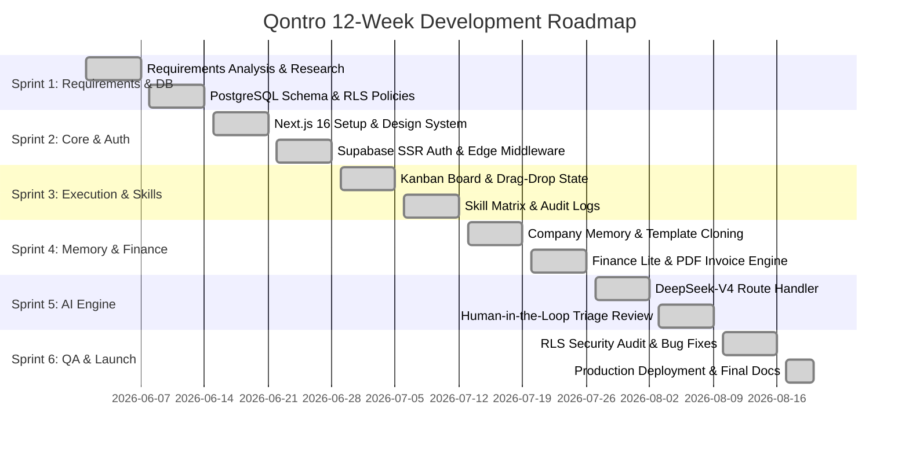

# Project Plan & Development Lifecycle: Qontro

**Document Reference:** QONTRO-PLAN-V1.0  
**Project Duration:** 12 Weeks (6 Two-Week Sprints)  
**Lifecycle Model:** Agile Scrum with Continuous Integration & Evaluation  
**Status:** Completed & Delivered  

---

## 1. Project Overview & Objectives

Qontro was engineered over a structured 12-week development cycle. The primary objective was to design, implement, test, and deploy a multi-tenant cloud SaaS platform that consolidates agency deliverables, team capacity, institutional knowledge, and receivables into a single command center.

---

## 2. Work Breakdown Structure (WBS)

```
QONTRO PLATFORM
├── 1. Requirements & Schema Design (Sprint 1)
│   ├── User interviews with digital agency founders
│   ├── IEEE 830 SRS documentation
│   └── PostgreSQL relational schema & RLS policy authoring
├── 2. Core Architecture & Multi-Tenancy (Sprint 2)
│   ├── Next.js 16 + React 19 App Router setup
│   ├── Supabase SSR auth cookie middleware pipeline
│   └── Zustand optimistic state store architecture
├── 3. Execution Board & Skill Graph (Sprint 3)
│   ├── 5-column drag-and-drop Kanban interface
│   ├── Verified skill matrix scoring engine
│   └── Immutable task history & comment audit logging
├── 4. Knowledge Base & Financial Ledger (Sprint 4)
│   ├── Company Memory SOP editor & 1-click duplication
│   ├── Finance Lite receivables & expense tracker
│   └── Printable PDF invoice generator
├── 5. AI Operations Engine (Sprint 5)
│   ├── DeepSeek-V4 Ollama Cloud API route integration
│   ├── Context serialization engine
│   └── Human-in-the-loop recommendation review cards
└── 6. QA, Security Audit & Production Launch (Sprint 6)
    ├── Cross-tenant RLS penetration testing
    ├── Performance benchmarking & Lighthouse audits
    └── Vercel edge & Supabase production deployment
```

---

## 3. Sprint Timeline & Gantt Schedule



---

## 4. Milestone Deliverables & Acceptance Criteria

| Milestone | Sprint Window | Core Deliverables | Acceptance Criteria | Status |
| :--- | :---: | :--- | :--- | :---: |
| **M1: Data Architecture** | Weeks 1–2 | Relational schema, RLS policies, ER diagrams. | `supabase-schema.sql` runs cleanly in Supabase with RLS on all 8 tables. | **COMPLETE** |
| **M2: Edge & Auth Core** | Weeks 3–4 | App Router shell, dark theme, `@supabase/ssr` cookies. | Users can sign up, log in, and maintain session across route transitions. | **COMPLETE** |
| **M3: Execution System** | Weeks 5–6 | Drag-and-drop Kanban, skill scoring, task history. | Moving task cards updates local state in <16ms and syncs to database. | **COMPLETE** |
| **M4: Memory & Finance** | Weeks 7–8 | SOP repository, contract cloning, PDF invoices. | 1-click duplication clones documents; invoices generate printable PDFs. | **COMPLETE** |
| **M5: AI Operations** | Weeks 9–10 | DeepSeek-V4 `/api/ai` route, approval cards. | AI returns structured recommendations; changes require human approval. | **COMPLETE** |
| **M6: QA & Production** | Weeks 11–12 | Security audit, performance benchmarks, documentation. | 100% test pass rate; sub-1.0s FCP; complete documentation suite delivered. | **COMPLETE** |

---

## 5. Resource Allocation & Team Responsibilities

- **Lead Full-Stack Architect:** Overall Next.js App Router architecture, Zustand state store, and DeepSeek AI integration.
- **Database & Security Specialist:** PostgreSQL schema, foreign key constraints, B-Tree index optimization, and Row Level Security policies.
- **Frontend / UI Engineer:** Tailwind CSS v4 design tokens, Kanban drag-and-drop mechanics, invoice PDF layout, and responsive layouts.
- **QA & Testing Engineer:** End-to-end user workflows, RLS cross-tenant penetration testing, and Lighthouse performance benchmarking.

---

## 6. Engineering Retrospective & Lessons Learned

1. **Optimistic UI vs Database Sync:** Early prototypes waited for network database responses before updating the UI, resulting in sluggish drag-and-drop feel. Shifting to an optimistic Zustand mutation pattern with background persistence eliminated all perceived latency.
2. **Database-Level RLS Over Frontend Filtering:** Implementing security checks at the database kernel via Supabase RLS policies ensured that even if a frontend component omitted a filter, zero cross-tenant data leaks could occur.
3. **Deterministic AI Boundaries:** Strict human-in-the-loop gating prevented unexpected automated mutations, establishing high user trust in AI-driven workload suggestions.
