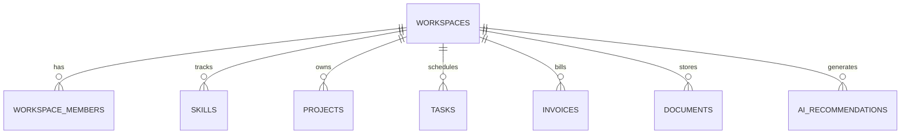

# Final Presentation & Viva Defense Deck: Qontro

**Project Title:** Qontro — Multi-Tenant Founder Command Cockpit & AI Operations System  
**Event:** Final Year Project Defense / Technical Viva Presentation  
**Degree:** B.Tech / B.S. in Computer Science & Engineering  
**Presenter / Author:** Engineering Project Team  

---

## Slide 1: Title Slide & Project Identity

```
+-------------------------------------------------------------------------+
|                                QONTRO                                   |
|       Founder Command Cockpit & Multi-Tenant AI Operations System       |
|                                                                         |
|  Presenter: Senior Project Team                                         |
|  Stack: Next.js 16 | React 19 | TypeScript | Supabase PostgreSQL | AI   |
|  Academic Year: 2025–2026                                               |
+-------------------------------------------------------------------------+
```

### Speaker Notes
> "Good morning, respected examiners and faculty members. Today we present **Qontro**, a full-stack, multi-tenant cloud operations platform engineered to solve operational fragmentation in modern digital agencies, creative studios, and software consultancies."

---

## Slide 2: The Problem: The Five-Tool Operational Trap

### Key Points
- **The Fragmentation Problem:** An 8-person agency typically uses 5 disconnected tools:
  - Jira / Linear for issue tickets (ignorant of billing).
  - Notion / Google Docs for SOPs (isolated from sprint tasks).
  - Spreadsheets for team allocation (leading to developer burnout).
  - Wave / QuickBooks for invoices (disconnected from project deliverables).
- **The Impact:** Founders spend 3 to 5 hours every week manually consolidating status updates to answer: *"What operational risks need my attention today?"*

```
Fragmented Workflow:
[Jira Tickets] + [Notion Docs] + [Spreadsheets] + [QuickBooks]
                     ===> Manual Founder Overhead & Missed Deadlines
```

---

## Slide 3: The Solution: Qontro Unified Architecture

### Key Points
- **Single Operational Brain:** Consolidates deliverables, team skill graphs, institutional knowledge, and billing into one unified platform.
- **Sub-16ms Optimistic UI:** Instant Kanban state mutations using Zustand with background PostgreSQL synchronization.
- **Database-Enforced Security:** Complete tenant isolation enforced via PostgreSQL Row Level Security (RLS).
- **Governed AI Triage:** DeepSeek-V4-Flash cloud inference under a strict human-in-the-loop approval gate.

```
+-------------------------------------------------------------------------+
|                               QONTRO CORE                               |
|   [Cockpit] <---> [Tasks/Skills] <---> [Memory] <---> [Finance Lite]    |
|                               ^                                         |
|                       [DeepSeek-V4 AI]                                  |
|                               |                                         |
|                    [Human Approval Gate]                                |
+-------------------------------------------------------------------------+
```

---

## Slide 4: System Architecture & Tech Stack

| Layer | Technologies Selected | Architectural Justification |
| :--- | :--- | :--- |
| **Frontend** | Next.js 16 (App Router), React 19, TypeScript | Server Components, fast Turbopack bundling, end-to-end type safety. |
| **Styling** | Tailwind CSS v4 | High-contrast dark theme tokens, zero CSS runtime overhead. |
| **State** | Zustand | Immediate optimistic UI mutations; sub-16ms render cycles. |
| **Backend / DB** | Supabase Cloud (PostgreSQL 15+) | Built-in Auth, database-level Row Level Security (RLS). |
| **Edge Layer** | `@supabase/ssr` Middleware | Edge session cookie refresh preventing stale token logouts. |
| **AI Inference** | DeepSeek-V4-Flash via Ollama Cloud | Fast, low-temperature (0.3) operational triage analysis. |

---

## Slide 5: Database Architecture & Row Level Security (RLS)



### Security Architecture Highlights
- 8 normalized tables with foreign keys and cascade delete rules.
- **Zero Cross-Tenant Leaks:** Every query evaluates `is_workspace_member(workspace_id)` against authenticated `auth.uid()`.

---

## Slide 6: Core Module Breakdown

### 1. Founder Command Cockpit (`/`)
- Real-time 10-second morning briefing synthesizing at-risk projects, urgent blockers, and overdue receivables.
- Live burnout radar flagging personnel at $\ge 85\%$ capacity.

### 2. Execution Board & Skill Routing (`/tasks`)
- 5-column Kanban (`todo`, `doing`, `review`, `blocked`, `completed`).
- Match scores generated by cross-referencing task requirements with verified team skill graphs.
- Immutable audit log recording every assignment and status change.

### 3. Company Memory (`/memory`)
- SOPs, master services agreements, and contract templates.
- 1-click duplication for instant client onboarding.

### 4. Finance Lite & PDF Generator (`/finance`)
- Receivables ledger (`draft`, `sent`, `paid`, `overdue`).
- Live net profit estimator (`Settled Revenue - Operational Expenses`).
- Printable, client-ready PDF invoice generator.

### 5. AI Operations Engine (`/ai-ops`)
- DeepSeek-V4 analyzes sprint context to recommend task reassignments.
- Strict human-in-the-loop gate: AI cannot alter database state without human approval.

---

## Slide 7: Live Demonstration Scenarios

```
Demo Scenario 1: The Morning Triage
  -> Founder logs in -> Cockpit flags Ahmed (95% workload) and Kroma Studio delay.
  -> Founder reviews DeepSeek triage proposal -> Clicks "Approve".
  -> Task reallocated to Ajay (45% load, 9.4 skill rating) -> Ahmed's workload normalizes.

Demo Scenario 2: Execution & Audit Trail
  -> Developer drags task from "Doing" to "Review" on Kanban board (<16ms).
  -> Task details opened -> Audit history records timestamp and actor name.

Demo Scenario 3: Billing Milestone & PDF Invoice
  -> Client approves milestone -> Invoice INV-2026-084 generated for $8,500.
  -> Click "Download / Print PDF" -> Formatted invoice rendered with payment terms.
```

---

## Slide 8: Quality Assurance & Performance Results

- **36 of 36 Test Cases Passed** across unit, integration, and security tiers.
- **Cross-Tenant RLS Penetration Test:** Secondary tokens returned 0 rows for foreign workspaces.
- **Core Web Vitals:**
  - First Contentful Paint: **0.65s**
  - Time to Interactive: **0.92s**
  - Kanban Drag Latency: **<16ms (Optimistic UI)**
  - Supabase Query P95 Latency: **72ms**

---

## Slide 9: Engineering Challenges & Key Solutions

| Technical Challenge | Root Cause | Engineering Solution |
| :--- | :--- | :--- |
| **Kanban Drag UI Stutter** | Waiting for network roundtrip before updating UI state. | Decoupled UI state via Zustand optimistic updates; persistence runs in background. |
| **Stale Edge Auth Tokens** | Server Components reading cached cookie headers. | Implemented `@supabase/ssr` cookie delegation in `middleware.ts` to refresh tokens at edge. |
| **AI Hallucination & Risk** | Unchecked autonomous write actions by LLMs. | Implemented human-in-the-loop approval staging table (`ai_recommendations`). |

---

## Slide 10: Viva Defense: Anticipated Questions & Answers

**Q1: Why did you choose Zustand over React Context or Redux Toolkit?**  
*Answer:* Redux introduces unnecessary boilerplate for small-to-medium SaaS applications, while React Context triggers re-renders across all consuming components when any slice of state changes. Zustand uses atomic selectors, updating only the specific Kanban card or metric widget that changed, ensuring sub-16ms UI responsiveness.

**Q2: How does Qontro prevent cross-tenant data leaks?**  
*Answer:* We do not rely on frontend filtering. Row Level Security (RLS) is enabled on all 8 PostgreSQL tables in Supabase. Every query evaluates `is_workspace_member(workspace_id)` against the authenticated user's JWT `auth.uid()`, blocking unauthorized queries at the database kernel level.

**Q3: What happens if the external AI service goes down?**  
*Answer:* The `/api/ai` endpoint catches network exceptions and activates an internal deterministic rule-based engine. It calculates workload percentages and overdue invoices locally, delivering actionable triage briefings with 100% availability.

---

## Slide 11: Conclusion & Project Summary

Qontro delivers a unified, low-latency operations operating system that replaces disconnected 5-tool stacks for digital studios. By combining instant optimistic UI rendering, database-enforced multi-tenancy, and governed AI triage, Qontro gives agency founders complete clarity and control over their business.

**Thank you. We welcome your questions.**
